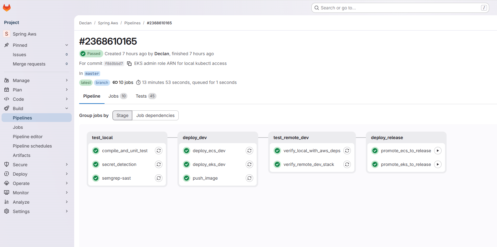

# CI/CD Pipelines and Runners

CI/CD runs on self-hosted runners deployed as EC2 instances inside AWS. Both [GitLab](../../../.gitlab-ci.yml)  and [GitHub](../../../.github/workflows/ci.yaml) pipelines follow the same stages and produce the same result. The pipelines handle both ECS and EKS deployments, driven by the environment blocks in [config.yaml](../../config.yaml).

Both runner types use an IAM instance role -- no long-lived AWS access keys in CI.

For bootstrapping (first-time runner deployment), see [readme](../../../readme.md). For runner stack CDK code and infrastructure details, see [cdk](../../cdk.md).




---

## Pipeline Stages

```
compile_and_unit_test              (no AWS access needed)
        |
    push_image                     (Jib -> ECR; needs AWS creds)
        |
   ---- deploy dev ----
   |                  |
deploy_ecs_dev    deploy_eks_dev   (config-driven: skipped if env block absent)
   |                  |
   ---- tests --------
        |
   ---- deploy release ----
   |                      |
promote_ecs_release   promote_eks_release   (manual gate)
```

Which deploy jobs run is determined at runtime by `ci/resolve-deploy-targets.sh`, which reads `config.yaml` and checks which environment blocks exist and their `computePlatform`. If there's no `k8s-dev` block, the EKS dev job is a no-op. The ECS and EKS jobs are independent -- you can run either or both.

For EKS deploy jobs, after `cdk deploy` creates the cluster infrastructure, the job runs `deploy-manifests.sh` to resolve K8s manifest placeholders from CloudFormation outputs and apply them via `kubectl`.

### CI file structure

Both GitLab and GitHub use an include-based structure: a main entry-point file includes a build file (compile + test, no AWS) and a deploy file (push image, deploy stacks). Comment out the deploy include for open-source showcasing.

**GitLab:**
- `.gitlab-ci.yml` -- entry point (stages, variables, cache, includes)
- `.gitlab/ci-build.yml` -- `compile_and_unit_test` (no AWS needed)
- `.gitlab/ci-deploy.yml` -- templates, push_image, ECS/EKS deploy jobs, tests, promote

**GitHub:**
- `.github/workflows/ci.yaml` -- entry point (calls build + deploy workflows)
- `.github/workflows/ci-build.yaml` -- reusable build workflow (no AWS needed)
- `.github/workflows/ci-deploy.yaml` -- reusable deploy workflow (ECS/EKS, config-driven)

**Helper script:**
- `cdk/app/ci/resolve-deploy-targets.sh` -- reads `config.yaml`, outputs `HAS_ECS_DEV`, `HAS_ECS_RELEASE`, `HAS_K8S_DEV`, `HAS_K8S_RELEASE`

### Branching strategy

- Push to `dev` branch -> runner automatically updates dev stacks (ECS and/or EKS) after tests pass
- Push to `main`/`master` -> runner runs tests, but **waits for manual approval** before touching release

### The manual gate

We intentionally avoid continuous deployment for the release environment. After tests pass on `main`:

1. **GitLab:** navigate to Build -> Pipelines, find the `promote_ecs_to_release` and/or `promote_eks_to_release` job, click **Play**
2. **GitHub:** the promote jobs require approval via environment protection rules (`env-release` for ECS, `env-k8s-release` for EKS)

Only approve after verifying the changes look correct in the dev environment.

### End-to-end flow

1. **Developer** pushes code to `dev` or `main`
2. **Runner** pulls code, runs tests/build, pushes container image to ECR
3. **Runner** deploys the dev stack(s) -- ECS (`cdk deploy`) and/or EKS (`cdk deploy` + `deploy-manifests.sh`)
4. **Pipeline pauses** at promote jobs on `main` (manual approval)
5. **Lead dev** reviews the dev environment and approves
6. **Runner** deploys the release stack(s):
   - **ECS release:** `cdk deploy` + `trigger_blue_green.sh` (canary traffic shift via CodeDeploy)
   - **EKS release:** `cdk deploy` + `deploy-manifests.sh --apply` (Kubernetes rolling update)

---

## Secrets (AWS Secrets Manager)

Runner registration tokens must be stored in Secrets Manager before deploying runner stacks. These tokens are retrieved from the GitLab/GitHub web UI when you first create a runner there, and are used by the EC2 instance to register itself on boot.

### GitLab

Retrieve the registration token from GitLab (**Settings -> CI/CD -> Runners**), then create the secret:

```bash
aws secretsmanager create-secret \
  --name GitlabRunnerToken-<ServiceName> \
  --secret-string "glrt-YOUR_TOKEN" \
  --profile <aws-profile>
```

- Secret name must match `config.yaml` -> `ci.gitlab.runnerTokenSecretName`
- Token value typically starts with `glrt-...`

### GitHub

```bash
aws secretsmanager create-secret \
  --name GithubRunnerToken-<ServiceName> \
  --secret-string "YOUR_TOKEN" \
  --profile <aws-profile>
```

- Secret name must match `config.yaml` -> `ci.github.runnerTokenSecretName`
- **Recommended:** a GitHub PAT with `repo` and `workflow` scopes (long-lived, can call the Actions registration-token API)
- **Fallback:** a one-time runner registration token from the GitHub UI (expires quickly, only useful for immediate bootstrap)

---

## Runner Targeting: GitLab Tags vs GitHub Labels

Runners are matched to pipeline jobs via tags (GitLab) or labels (GitHub). The values are defined in `config.yaml`:

```jsonc
"ci": {
  "gitlab": { "runnerTag": "<runner-tag>" },
  "github": { "runnerLabels": ["<runner-label>"] }
}
```

**You must manually enter these same values in the web UI:**
- GitLab: assign the tag to your runner in **Settings -> CI/CD -> Runners**
- GitHub: the label is set during runner registration (from the secret token), but verify it matches in **Settings -> Actions -> Runners**

In the pipeline files:
- `.gitlab-ci.yml` uses `tags: [<runner-tag>]`
- `ci.yaml` uses `runs-on: [self-hosted, linux, x64, <runner-label>]`

---

## GitLab vs GitHub Differences

The pipelines are functionally equivalent but differ in how they handle a few things:

| Aspect | GitLab | GitHub |
|--------|--------|--------|
| Runner targeting | `tags:` | `runs-on:` |
| AWS creds in job | Explicit IMDSv2 fetch (see below) | SDK reaches IMDS directly |
| Stack name resolution | Shell script parsing `config_common.yaml` | Node.js script using `yaml` package |
| Deploy target resolution | `eval $(./ci/resolve-deploy-targets.sh)` | Step output via `$GITHUB_OUTPUT` |
| Release gate | `when: manual` on the job | `environment: release` (requires approval) |
| Dependency install | `npm ci` in `before_script` | `npm ci` in a step |
| EKS manifest deploy | `deploy-manifests.sh` in script block | `deploy-manifests.sh` in step |
| Workflow includes | `include: local:` | `uses: ./.github/workflows/...` (`workflow_call`) |

### Why GitLab needs the IMDSv2 dance

GitLab runner jobs execute inside Docker containers on the EC2 host. The container can't automatically reach the host's instance metadata endpoint (169.254.169.254), so the pipeline explicitly:

1. Fetches a metadata token via IMDSv2
2. Retrieves temporary credentials from the instance's IAM role
3. Exports `AWS_ACCESS_KEY_ID`, `AWS_SECRET_ACCESS_KEY`, `AWS_SESSION_TOKEN` into the job

This is the `.assume_instance_role_env` snippet in `.gitlab/ci-deploy.yml`.

GitHub Actions on a self-hosted EC2 runner runs directly on the host (no job container by default), so the AWS SDK reaches IMDS without extra steps.

---

## Runner Stacks (AWS Infrastructure)

Both GitLab and GitHub runners are deployed as CDK stacks. They inherit from `CiRunnerStackBase` (in `cdk/app/ci/`), which creates:

- EC2 instance in the **dev VPC's public subnet**
- IAM instance profile with permissions to deploy all CDK stacks
- Security group, CloudWatch log group
- Secrets Manager access for runner registration tokens

Each provider subclass adds provider-specific UserData scripts to register the runner on boot.

Runner stacks capture region/account from your active AWS profile during `cdk deploy`. The runner instances then use those same values when deploying dev/release in CI.

### Cost decision

Runners live in the dev VPC's public subnet specifically to avoid NAT Gateway fees (~$32/month). They need internet access to pull dependencies and communicate with GitLab/GitHub. A public subnet with an internet gateway provides that for free. _Tradeoff:_ you must deploy the dev stack before deploying a runner stack, since the runner reuses the dev VPC.

### Runner IAM role

The runner's role is intentionally broad -- it needs to create and update all infrastructure:
- Deploy CloudFormation stacks (all CDK stacks)
- Push container images to ECR
- Manage ECS services and task definitions
- Manage EKS clusters and apply K8s manifests (via kubectl)
- Trigger CodeDeploy for blue/green (ECS release)
- Read/write S3, Secrets Manager, IAM, Route 53, WAF, ACM

---

## Moving Runners Outside AWS

If you move CI to standard GitHub Actions runners (or any non-AWS CI), you lose the IAM instance role. You need to provide credentials explicitly to compensate.

### What to provide

| Credential | Where to store it | Notes |
|------------|-------------------|-------|
| `AWS_ACCESS_KEY_ID` | Repository secret | from an IAM user or OIDC federation |
| `AWS_SECRET_ACCESS_KEY` | Repository secret | paired with the access key |
| `AWS_SESSION_TOKEN` | Repository secret | only if using temporary credentials (OIDC) |
| `AWS_REGION` | Repository variable | same region as your stacks |

### OIDC federation (recommended)

OIDC is preferred over long-lived access keys. The idea: configure GitHub's OIDC provider as a trusted identity in AWS IAM, then use `AssumeRoleWithWebIdentity` in your workflow to get short-lived credentials. No stored secrets to rotate, no access keys that could leak.

The IAM role you assume via OIDC needs the same permissions the EC2 runner role currently has.

### What changes in the pipeline

- **Remove** the IMDSv2 credential-fetching step (`.assume_instance_role_env` in GitLab)
- **Add** a `configure-aws-credentials` action step (GitHub) or set env vars from CI secrets (GitLab)
- **Change** runner label/tag references from self-hosted to hosted runners
- **Remove** the runner CDK stacks entirely (no longer needed)
- **Everything else stays the same:** build, test, `cdk deploy`, `jib` push, `deploy-manifests.sh` all work identically once credentials are in the environment

You'd also lose the dev-VPC cost optimization, but standard hosted runners don't incur NAT gateway charges since they don't live in your VPC.

---

### GitHub: manual gate options

There are two ways to implement the manual release gate in GitHub Actions:

**Environment protection rules** (currently used): The promote jobs reference `environment: name: env-release` (ECS) or `environment: name: env-k8s-release` (EKS). Configure the gate in the GitHub UI:

1. Go to **Settings -> Environments -> New environment**, name it `env-release` and/or `env-k8s-release` (must match the `name` value in the GitHub CI file exactly)
2. Enable **Required reviewers** and add approvers
3. The pipeline will pause at that job and wait for approval

This enforces not just that someone must approve but additionally *who* must do so. However, required reviewers on environments are only available on paid plans (GitHub Team/Enterprise for private repos).

**Workflow_Dispatch** (alternative): Move promote jobs into a separate workflow file that can only be triggered manually from the Actions tab. This mirrors GitLab's `when: manual` behavior: someone must deliberately click "Run workflow" to deploy to release. No additional UI configuration needed, and works on all plans. _Tradeoff:_ requires a separate workflow file and doesn't control who can trigger it (anyone with write access can).