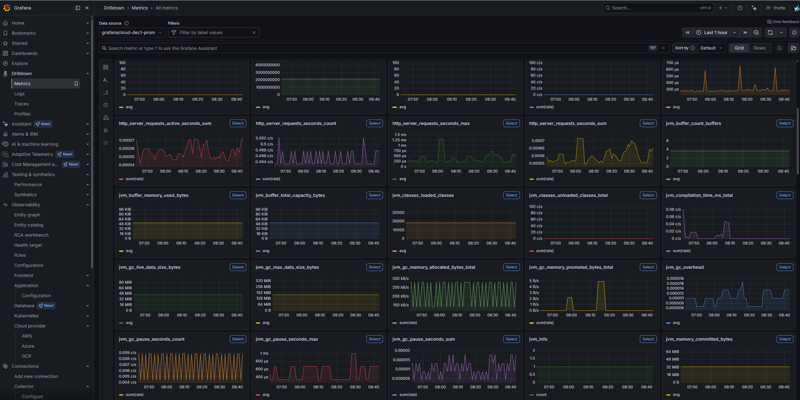

# Grafana: Application Metrics

Optional Prometheus metrics forwarding from your ECS Fargate tasks to a Grafana instance. Enabled via `wantGrafana: true` in `config.yaml` and set the3 environment variables as described below.

For general infrastructure details, see [cdk](../../../../../../cdk.md). For CI pipeline details, see [ci](../../../../../ci/ci.md).

---


## How It Works

The Spring Boot app exposes JVM and application metrics at `/actuator/prometheus` (via Micrometer). A Grafana Alloy sidecar container runs alongside the app in each ECS task, scrapes that endpoint every 15 seconds, and pushes the data to Grafana Cloud using Prometheus remote-write over HTTPS.

```
┌──────────────────────── ECS Task ────────────────────────┐
│                                                           │
│  Spring Boot App            Grafana Alloy Sidecar         │
│  (port 8080)                (port 12345)                  │
│       │                           │                       │
│       │  /actuator/prometheus     │                       │
│       │◄────── scrape (15s) ──────┤                       │
│       │                           │                       │
│       │                           ├─── remote-write ──────┼──► Grafana Cloud
│       │                           │    (basic auth)       │
│                                                           │
└───────────────────────────────────────────────────────────┘
```

Grafana Cloud does not connect to your AWS account. The data flow is one-directional: your sidecar pushes metrics outbound via HTTPS. Grafana Cloud receives them like any other Prometheus remote-write client -- it has no knowledge of ECS, your VPC, or AWS.

---

## Setup (From Scratch)


### 1. Create a Grafana Cloud Account
You can use your own Grafana instance, but here detailed instructions for Grafana Cloud are provided.  
Sign up at [grafana.com](https://grafana.com). You get one free "stack" -- a bundled set of hosted services:

- A **Grafana instance** for dashboards (e.g. `https://yourname.grafana.net`)
- A **Prometheus/Mimir instance** for metrics storage (what your sidecar pushes to)
- A Loki instance (logs) and Tempo instance (traces), if you use them later

One stack is sufficient. Multiple apps can share the same stack, distinguished by metric labels.

### 2. Get the 3 Credential Values

You need three values. Two are permanent properties of your stack; the third is a token you generate.

**URL and Instance ID** (always viewable):

1. Go to **grafana.com** (the Cloud Portal -- not your `.grafana.net` instance).
2. Click on your **stack name** to open the stack overview.
3. Find the **Prometheus** card and click **"Details"**.
4. The details page shows:
   - **Remote Write Endpoint**: e.g. `https://prometheus-prod-24-prod-eu-west-2.grafana.net/api/prom/push`
   - **Username / Instance ID**: a numeric value like `1234567`

**API Token** (shown once at creation, not retrievable later):

On the same Prometheus details page, look for a **"Generate now"** link to create a Cloud Access Policy token. Alternatively:

1. In your Grafana instance (`yourname.grafana.net`), go to **Connections > Add new connection**.
2. Search for **"Hosted Prometheus metrics"** and open the **Configuration details** tab.
3. In section 3 ("Set the configuration"), fill in a token name and click **"Create token"**.
4. **Copy the token immediately.** It cannot be viewed again.

Or create one manually at **grafana.com > Security > Access Policies** with the `metrics:write` scope.

### 3. Set CI/CD Variables

Add the three values as CI/CD variables in your GitLab project (**Settings > CI/CD > Variables**) or GitHub repository secrets:

```
GRAFANA_REMOTE_WRITE_URL  =  <Remote Write Endpoint from step 2>
GRAFANA_USERNAME          =  <Instance ID from step 2>
GRAFANA_API_KEY           =  <Token from step 2>
```

Mark them as protected and masked where possible.

These are read at CDK synth time and passed into the Alloy sidecar container as environment variables. The names correspond to what the Grafana Cloud UI calls `GCLOUD_HOSTED_METRICS_URL`, `GCLOUD_HOSTED_METRICS_ID`, and `GCLOUD_RW_API_KEY` respectively.

> **If you lose the API token:** generate a new one and update the CI/CD variable. The URL and instance ID never change and are always visible on the Prometheus details page.

### 4. Enable in Config

In `config.yaml`, set:

```json
"wantGrafana": true
```

### 5. Deploy

The next CI/CD deploy (or manual `cdk deploy`) will attach the Alloy sidecar to each ECS task. Alloy waits for the app container to become healthy, then begins scraping and pushing metrics.

### 6. Verify

Go to your Grafana instance (`yourname.grafana.net`):

- **Drilldown > Metrics** (left sidebar): grid view of all available metrics. Good for exploring.
- **Explore** (left sidebar): select your Prometheus data source, query `jvm_memory_used_bytes` to confirm data flow.

---

## What the Spring App Provides

Already configured in the project -- no changes needed to enable Grafana:

| Component | File | What it does |
|-----------|------|-------------|
| `spring-boot-starter-actuator` | `build.gradle.kts` | Exposes management endpoints |
| `micrometer-registry-prometheus` | `build.gradle.kts` | Formats metrics as Prometheus text |
| Endpoint exposure | `application.yaml` | `management.endpoints.web.exposure.include: health,info,metrics,prometheus` |

The app emits metrics at `/actuator/prometheus` in standard Prometheus format. It has no awareness of Grafana or the sidecar.

---

## What CDK Creates

When `wantGrafana: true`, the Fargate service construct (`lib/constructs/platform/ecs/service.ts`) conditionally adds a `GrafanaAlloySidecarConstruct`:

| Resource | Details |
|----------|---------|
| Sidecar container | Grafana Alloy image, 128 CPU / 256 MiB, `essential: false` |
| Config volume | `agent.river` (base64-encoded into an emptyDir mount) |
| Container dependency | Alloy waits for the app container to report `HEALTHY` |
| Environment vars | `GRAFANA_REMOTE_WRITE_URL`, `GRAFANA_USERNAME`, `GRAFANA_API_KEY` |
| Logs | CloudWatch, `<service>-<env>-alloy` stream prefix, 1-week retention |

The sidecar config (`agent.river`) defines two blocks: a `prometheus.remote_write` target pointing at your Grafana Cloud endpoint, and a `prometheus.scrape` job targeting `localhost:8080/actuator/prometheus`.

### Relevant files

```
lib/constructs/platform/ecs/
  service.ts                  <-- conditionally creates the sidecar
  grafana/
    grafana.ts                <-- GrafanaAlloySidecarConstruct
    agent.river               <-- Alloy scrape + remote-write config
```

---

## Multiple Apps, One Stack

All metrics pushed to the same Grafana Cloud stack land in one shared Prometheus store. Apps are distinguished by **labels**, not by separate accounts or credentials.

The `agent.river` config automatically sets `job` and `instance` labels. To distinguish additional services, add an `app` or `service` label in the scrape config or via `external_labels` in `agent.river`. Then filter in Grafana dashboards with `{service="my-app"}`.

Multiple apps reuse the same 3 CI/CD variables. The credentials identify the Grafana Cloud stack, not a specific app.

---

## What to Look At

### Routine Health Check

The Metrics Drilldown page gives a bird's-eye view. The most useful JVM panels:

| Metric | What it tells you | When to worry |
|--------|-------------------|---------------|
| `jvm_memory_used_bytes` | Heap and non-heap usage | Sustained climb toward max = potential leak |
| `jvm_gc_pause_seconds_max` | Longest GC pause per scrape interval | Spikes above ~200ms affect latency |
| `jvm_gc_pause_seconds_count` | How often GC runs | Rapid increase = memory pressure |
| `jvm_threads_live_threads` | Active thread count | Sudden spike = thread leak or blocked I/O |
| `jvm_classes_loaded_classes` | Loaded class count | Should stabilize after startup |
| `jvm_buffer_memory_used_bytes` | Direct/mapped buffer usage | Relevant for heavy I/O (S3 streaming) |

### After a Deployment

Check `jvm_gc_pause_seconds_max` and `jvm_memory_used_bytes` for the first 10-15 minutes. Compare to the previous deployment's pattern -- a memory regression shows up here fast.

### Custom Dashboards

For a single-page JVM overview, import community dashboard **4701** ("JVM Micrometer"):
Grafana left sidebar > Dashboards > Import > enter `4701` > select your Prometheus data source.

---

## Cost

### ECS (AWS side)

The sidecar adds 128 CPU / 256 MiB per task. Fargate bills per task, not per container, so the cost depends on whether this pushes the task to a higher billing tier. If there is headroom in the existing allocation, the incremental cost may be zero.

Worst case (sidecar causes a billing increment on both dev and release tasks): roughly **$8-10/month**.

### Grafana Cloud

The free tier includes **10,000 active metric series** with **14-day retention**. A single Spring Boot app with Micrometer typically produces a few hundred to a couple thousand series. One service with two environments is well within the free tier.

The next tier (Pro) is $19/month and extends retention to 13 months.

---

## The Custom Alloy Debug Image

The project includes a Dockerfile for a custom Alloy image (used when `wantDebug: true` in `grafana.ts`, which is the current default). It:

1. Copies the `alloy` binary from the official `grafana/alloy:latest` image
2. Packages it in `debian:bookworm-slim` with debug tools (curl, wget, netstat, dig, procps)
3. Installs a **Zscaler corporate proxy certificate** so HTTPS works behind TLS-inspecting proxies

This image is useful for two scenarios:
- **Running Alloy locally** alongside a local Spring Boot app for testing (the original motivation -- the official image fails behind Zscaler)
- **Extended diagnostics in ECS** -- the `wantDebug: true` startup script tests connectivity, verifies the actuator endpoint, and validates the Alloy config before starting

Once the sidecar is working reliably, set `wantDebug: false` in `grafana.ts` to switch to the official `grafana/alloy:latest` image. But keep the custom image (or a slimmer variant) if your environment routes through a TLS-inspecting proxy.

---

## Grafana's "AWS" Sections (Not Used Here)

Grafana Cloud has an "AWS Observability" feature (under Connections > Cloud Provider > AWS) that can pull CloudWatch metrics directly from your AWS account by assuming an IAM role. This is a **completely separate integration** from what is described here.

| This project (Alloy sidecar)       | AWS Observability (not used)            |
|-------------------------------------|-----------------------------------------|
| JVM heap, GC, threads               | ECS CPU/memory utilization              |
| HTTP request latency, error rates   | ALB request counts, 5xx rates           |
| Custom app metrics                  | RDS connections, S3 request counts      |
| Push from your task, no IAM needed  | Pull from CloudWatch, needs IAM role    |

The two are complementary. The AWS integration adds infrastructure visibility but requires IAM setup and consumes additional metric series. For application-level observability, the sidecar approach gives you the most useful data with no AWS configuration.

---

## Tradeoffs

| Consideration | Detail |
|---------------|--------|
| Free tier limits | 10,000 active series, 14-day retention. Enough for one service. |
| Sidecar cost | ~$4-10/month across both envs. Marked `essential: false` -- won't kill the app if it crashes. |
| Credentials | API key is a plain container env var, not in Secrets Manager. Acceptable for dev; for production, consider pulling from Secrets Manager at runtime. |
| Debug image default | `wantDebug: true` uses the custom image on every deploy. Switch to `false` once stable. Keep the custom image if Zscaler is in play. |
| Token is show-once | If you lose the API key, generate a new one and update the CI/CD variable. URL and instance ID are always visible. |
| Retention | 14 days on free tier. For month-over-month comparison, Pro tier ($19/month) gives 13 months. |