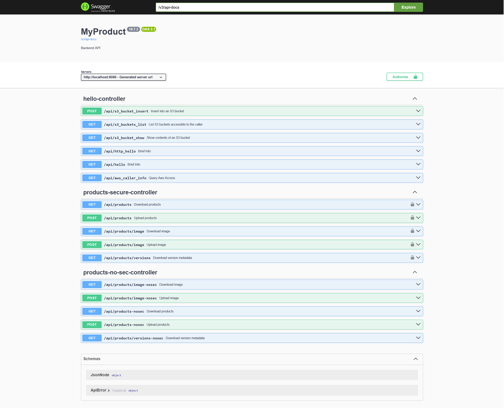

# Spring Web Application

Spring Boot (Kotlin) REST API that manages the submission and retrieval of binary and textual data, persisted, with versioning in S3, secured by Cognito JWTs via the OAuth2 Client Credentials flow.



For deployment and infrastructure, see the main [readme](../readme.md) and [cdk](../cdk/cdk.md). For identity provider details and credential retrieval, see [idp](../cdk/app/idp/idp.md).

---

## Setup
These instructions are in addition to the general [setup](../setup.md).


- #### JAVA + Gradle
    If you want to be able to run/debug the web app locally, you will need to install JAVA (21+). 
    Gradle is used as a build system, and in  oder to be able to interact with it directly (i.e. call `gradlew`) you also need to  set the environment variable `JAVA_HOME` to point to your local JAVA installation directory (so Gradle can find the correct JDK):

    _(Note: _JAVA_HOME_ is Gradle's way of locating a JDK when run from the command line. IntelliJ IDE manages its own set of JDKs and points Gradle to the active one automatically -- you never need to set `JAVA_HOME` yourself when working inside IntelliJ GUI.)_


    **Windows (PowerShell):**
    ```powershell
    $env:JAVA_HOME="C:\Users\<User-Name>\.jdks\corretto-21.0.8"
    ```

    **Windows (Command Prompt):**
    ```cmd
    set JAVA_HOME=C:\Users\<User-Name>\.jdks\corretto-21.0.8
    ```

    **Linux (apt-based):**
    ```bash
    export JAVA_HOME=/usr/lib/jvm/java-21-openjdk-amd64
    ```

    **macOS** (use `-v` if multiple JDKs installed):
    ```bash
    export JAVA_HOME=$(/usr/libexec/java_home -v 21)
    ```

- #### AWS Credentials

    The app interacts with AWS resources (S3, STS) at runtime, whether running locally or deployed. It always needs valid credentials.

    **Deployed (ECS/EKS):** The container uses the IAM task role defined in the CDK infrastructure. Your local credentials (used to deploy) act as an upper boundary -- they control what permissions can be assigned to the IAM role. The IAM role itself is the runtime boundary -- it limits what the running container can actually do.

- #### Proxy (e.g. Zscaler)

    If behind a corporate proxy like Zscaler, you need to import its certificate into the JDK's truststore for the app to download dependencies at build time and access the internet at runtime. See [local/proxy readme.md](local/proxy/readme.md) for import instructions.

    You may also need to increase Jib timeouts in `gradle.properties` (or better, `~/.gradle/gradle.properties` since these are machine-specific):

    ```properties
    systemProp.jib.httpTimeout=300000
    systemProp.jib.connectionTimeout=300000
    ```

    For proxy issues affecting CDK or Docker, see the [root readme](../readme.md).

---

#### Build and Run

```bash
./gradlew clean build
./gradlew bootRun
```

Once running:
- Swagger UI: http://localhost:8080/swagger-ui/index.html
- Actuator health: http://localhost:8080/actuator/health
- Actuator info: http://localhost:8080/actuator/info
- Actuator metrics: http://localhost:8080/actuator/metrics
- Prometheus endpoint: http://localhost:8080/actuator/prometheus

---

- #### Spring Profiles and Common Configuration Injection

    - **Base Profile** (`application.yaml`)

        At build time, Gradle injects the contents of `config_common.yaml` into `application.yaml` by replacing the `# configCommon_placeholder` comment. This makes values like `configCommon.appVersion` and `configCommon.serviceName` available as normal Spring properties.

        Key runtime properties and where they come from:

        | Property | Source when deployed | Source when local |
        |----------|---------------------|-------------------|
        | `app.version` | `${configCommon.appVersion}` (injected at build) | same |
        | `app.aws.region` | `AWS_REGION` env var (set by CDK on container) | `AWS_REGION` env var (set by you) |
        | `app.s3.bucket-name` | `S3_DATA_BUCKET` env var (set by CDK per stack - originally from _cdk/config.yaml_) | falls back to dev bucket name in YAML |
        | JWT issuer URI | `SPRING_SECURITY_OAUTH2_RESOURCESERVER_JWT_ISSUER_URI` (set by CDK) | falls back to hardcoded Cognito pool URL in YAML |

        Spring's standard resolution order applies: _**env var** > **system property** > **YAML** value._ 
        The YAML inline defaults (after `:`) exist as a safety net, but you should always have `AWS_PROFILE` and `AWS_REGION` set locally for consistency with CI.

    ####
    - **Test Harness** (`application-test-harness.yaml`)

        Activating the `test-harness` profile adds `-nosec` (unauthenticated) versions of every API endpoint, as well as an additional _degug endpoints_ that provide additional information. Useful for local manual testing (without obtaining tokens).

        ```bash
        SPRING_PROFILES_ACTIVE=test-harness ./gradlew bootRun
        ```

        This is independent of the dev/release distinction. Both deployed environments run without test-harness. The profile only controls whether `ConfigLogicNoSecController` and `HelloController`(annotated `@Profile("test-harness")`) are active.

    ---

## API Endpoints

All endpoints are under `/api/conf-logic/` and require a Bearer JWT (Cognito) with appropriate role claims.

| Method | Path | Auth | Purpose |
|--------|------|------|---------|
| GET | `/versions` | `Role_Read` | Metadata (version, lastModified) for products and image |
| GET | `/products` | `Role_Read` | Download json (text) |
| POST | `/products` | `Role_Write` | Upload json (validated text) |
| GET | `/products/image` | `Role_Read` | Download image (binary) |
| POST | `/products/image` | `Role_Write` | Upload image (binary)|

Swagger UI: `/swagger-ui/index.html`

With `test-harness` profile active, all endpoints are also available at `*-nosec` paths without authentication.

---

## Using Swagger UI

Swagger UI is available at `/swagger-ui/index.html`.

**Locally** (with `test-harness` profile active): all endpoints appear twice -- the standard paths (requiring a Bearer token) and the `-nosec` variants (no auth needed). Use the `-nosec` paths to test without credentials.

**Against the deployed dev instance**: all endpoints require authentication. Click the "Authorize" button in Swagger UI and paste a Bearer token. Tokens are short-lived JWTs issued by Cognito.

### Getting a token (one-liner)

First export the client credentials (retrieve these from the Cognito stack -- see [idp](../cdk/app/idp/idp.md#retrieving-credentials-scripts)):
```bash
export INT_CLIENT_ID=<val>
export INT_CLIENT_SECRET=<val>
export EXT_CLIENT_ID=<val>
export EXT_CLIENT_SECRET=<val>
```

Then fetch a token:

**Internal client (read + write):**
```bash
curl -s -u "$INT_CLIENT_ID:$INT_CLIENT_SECRET" \
  -d "grant_type=client_credentials&scope=api://my-backend/read+api://my-backend/write" \
  "https://my-backend-auth-739275440763.auth.eu-west-3.amazoncognito.com/oauth2/token" \
  | grep -o '"access_token":"[^"]*' | cut -d'"' -f4
```

**External client (read only):**
```bash
curl -s -u "$EXT_CLIENT_ID:$EXT_CLIENT_SECRET" \
  -d "grant_type=client_credentials&scope=api://my-backend/read" \
  "https://my-backend-auth-739275440763.auth.eu-west-3.amazoncognito.com/oauth2/token" \
  | grep -o '"access_token":"[^"]*' | cut -d'"' -f4
```

Copy the printed token string. In Swagger UI click "Authorize", enter `Bearer <token>`, and confirm. The token is valid for a short window (typically 1 hour); re-run the curl when it expires.


---

## Test Tiers

| Tier | Source dir | What it tests | AWS needed? |
|------|-----------|---------------|-------------|
| Unit (`test`) | `src/test/` | Domain logic, parsing, validation | No |
| Integration (`integrationTest`) | `src/integrationTest/` | Controller round-trips with MockMvc | No |
| System (`systemTest`) | `src/systemTest/` | Full Spring Boot with real S3 | Yes (dev bucket) |
| Manual (`manualTest`) | `src/manualTest/` | Console smoke tests, deployed endpoints | Yes |

```bash
./gradlew test                  # unit tests only
./gradlew integrationTest       # integration tests
./gradlew systemTest            # needs real AWS credentials
./gradlew check                 # runs test + integrationTest + systemTest
```

All tiers share `src/test/resources` for fixtures (Excel files, JSON).

For the design rationale behind this tier structure (environment isolation strategy, FakeAws design, tradeoffs), see [src/testing.md](src/testing.md). For manual end-to-end tests, see [src/manualTest/manualTest.md](src/manualTest/manualTest.md).

### FakeAws

Unit and integration tests use `FakeAws`, a deterministic in-memory S3 simulation. It has a manual clock: every `put` ticks the clock forward exactly 1 second, so version-ordering and timestamp tests are 100% reproducible with no network or system-clock dependency.

### Test-harness in tests

`build.gradle.kts` automatically activates the `test-harness` Spring profile for all test tasks (via `spring.profiles.active` system property). This means tests can hit the `-nosec` endpoints without dealing with JWT tokens.

---

## Building Container Images (Jib)

Jib builds and pushes container images without needing a local Docker daemon. The target registry is determined by `imageSource` in `config_common.yaml`.

**ECR (default):**
```bash
export JIB_USERNAME="AWS"
export JIB_PASSWORD="$(aws ecr get-login-password --region $AWS_REGION)"
./gradlew jib
```

**DockerHub:**
```bash
export JIB_USERNAME="<dockerhub-username>"
export JIB_PASSWORD="<dockerhub-token>"
./gradlew jib
```

The image path is resolved by `resolveJibImagePath()` in `build.gradle.kts`, which reads the AWS account ID (from env or `aws sts get-caller-identity`), region, and image name from `config_common.yaml`.

To build a local Docker image instead (requires Docker running):
```bash
./gradlew jibDockerBuild
```

